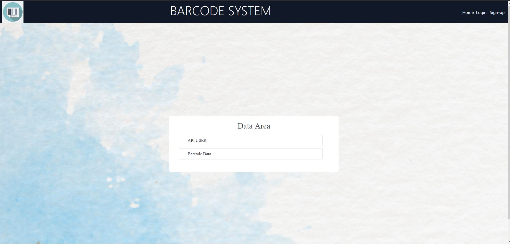
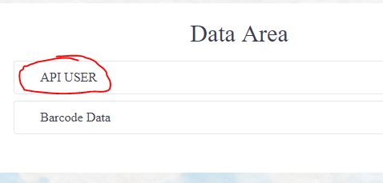

# flask-crud 
this project is design for barcode database

## cd flask-crud 

pip install -r requirements.txt

python app.py

## thanks to sir @jj for the support

# How to use

`press API button for the user and barcode database`

# Create a Login Account

#Build a Flask CRUD Application with MVC Architecture

project/ 

├── templates/

|     └── index.html

├── migrations/ **

|     └── ...

├── routes/

|     └── user_bp.py

├── models/

|     └── User.py

├── controllers/

|     └── UserController.py

├── app.py

└── config.py

'''
    flask db init : it will create the migrations folder with a version subfolder.

    flask db migrate : it will detect the model changes with an upgrade and downgrade logic set up.

    flask db upgrade : it will apply the model changes you have implemented.

    flask db downgrade : if something goes wrong, you can use this command to unapply changes you 
    have done on your model file.
'''